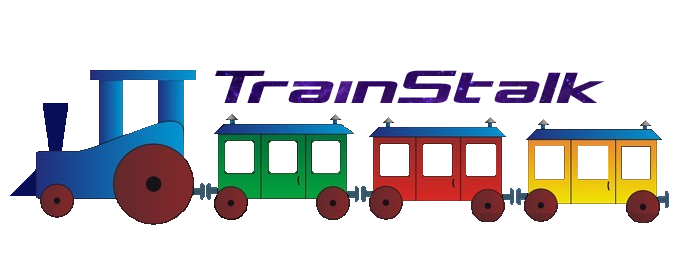

<h1 align="center">
  
</h1>

---

# TrainStalk

## Petit résumé

- N'avez vous jamais révé de pouvoir suivre en détail et en direct un train de votre choix ? C'est maintenant possible avec TrainStalk !

## Objectifs

- Création d'une Onthologie
- Création d'un site web utilisant les principes du RDF
- Utilisation d'api provenenant de plusieurs sources différentes

## API Utilisé

- https://ressources.data.sncf.com/explore/dataset/liste-des-gares/table/ (Static)
- https://api.sncf.com/v1/coverage/sncf/vehicle_journeys/ (Dynamique)
- https://api.sncf.com/v1/coverage/sncf/stop_points/ (Dynamique)
- https://www.infoclimat.fr/public-api/ (Dynamique)

## Techno

- JavaScript
- NodeJs v16.14.1
- Visual Studio Code

## Lancer le projet

- Installer la version NodeJs v16.14.1
- Ouvrir le répertoire Site avec Visual Studio Code
- Launch in a terminal :
```bash
  npm install
  npm run start
```

## UI


## Auteur

- [@Flaye](https://github.com/Flaye)
- [@Pierre](https://github.com/Pierre-Portfolio)
- [@Dany](https://github.com/dany123000)
- [@Elie](https://github.com/ElieObadiaDevinci)