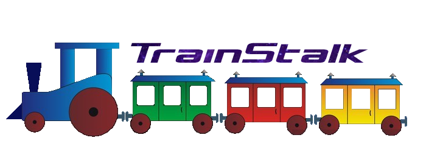
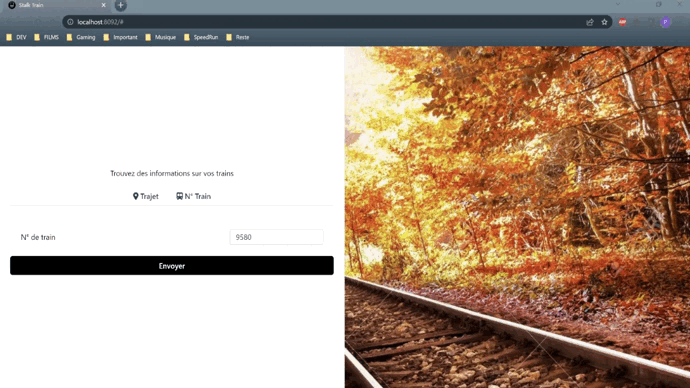

<h1 align="center">
  
</h1>


---

# TrainStalk — Suivez votre train en direct

## Aperçu
N'avez-vous jamais rêvé de pouvoir suivre en détail et en direct un train de votre choix ? C'est maintenant possible avec **TrainStalk** !

Le projet est un **site web de web sémantique** : à partir d'un trajet (gare de départ → gare d'arrivée) ou d'un **numéro de train**, il interroge les **API de la SNCF** et d'**Infoclimat**, convertit leurs réponses JSON en **RDF** grâce à une **ontologie maison** (OWL, construite sous Protégé), puis les interroge en **SPARQL** pour afficher chaque arrêt du train, ses horaires et la météo sur place.

## Fonctionnalités

### Site web (`Site/public/`)
- **Recherche par trajet** : gare de départ et gare d'arrivée, avec **autocomplétion** sur la liste officielle des gares SNCF
- **Recherche par numéro de train** : récupère le parcours du jour du train (grandes lignes, sinon trains régionaux)
- **Navigation arrêt par arrêt** (précédent / suivant) : nom de la gare, heure d'arrivée, heure de départ, type de train
- **Météo à chaque arrêt** : température, vent et pluie aux coordonnées de la gare
- Page annotée en **RDFa** (`station:NomGare`, `hour:Hours`, `train:Size`, `weather:*`) pour que les données affichées restent lisibles par une machine

### Web sémantique (`Site/src/Onthologies/`)
- **Ontologie OWL** (`Protege/OWL-Projet.owl`) : gares, trains, trajets, arrêts, coordonnées, météo
- **Contextes JSON-LD** par source (`Gare`, `Train`, `Weather`) qui projettent le JSON brut des API sur l'ontologie
- **Conversion en RDF** (N-Quads) avec `jsonld.toRDF`, chargée dans un **triplestore Oxigraph** en mémoire
- **Requêtes SPARQL** (`SELECT` / `ASK`) pour retrouver le code UIC d'une gare, le parcours d'un train ou la météo ; la saisie de l'utilisateur est échappée avant d'entrer dans une requête
- **Règles SWRL** (`Rapport/swrl.txt`) : train de nuit, long trajet
- Alignement avec **schema.org** (`TrainStation`, `TrainTrip`)

### Serveur (`Site/index.js`)
- Serveur **Express** qui sert le site et expose les routes de requêtage RDF
- En-têtes de sécurité avec **Helmet**, **CORS** activé

## Technologies
- **Node.js (≥ 18) / Express** — serveur web et routes de requêtage
- **JSON-LD** (`jsonld`) — passage du JSON des API au RDF
- **Oxigraph** — triplestore en mémoire et moteur SPARQL
- **OWL / Protégé / SWRL** — ontologie et règles d'inférence
- **HTML / JavaScript / Tailwind CSS / Font Awesome** — interface web
- **Visual Studio Code** — environnement de développement

## Installation

Clonez le dépôt :

```bash
git clone https://github.com/Pierre-Portfolio/TrainStalk.git
cd TrainStalk/Site
```

Installez **Node.js 18 ou plus récent**, puis les dépendances :

```bash
npm install
```

### Lancer le projet

```bash
npm run start
```

puis ouvrez `http://localhost:8092/`.

- **En développement** : `npm run dev` relance le serveur à chaque modification (nodemon).

## Structure du projet
```
TrainStalk/
  README.md                  → Présentation du projet
  Assets/                    → Images README (bannière, démo)
  Rapport/
    Report.docx              → Rapport du projet
    SchemaOrg/               → Types schema.org utilisés (TrainStation, TrainTrip)
    swrl.txt                 → Règles SWRL (train de nuit, long trajet)
  Site/
    index.js                 → Serveur Express + requêtes SPARQL
    package.json             → Dépendances et scripts (start, dev)
    public/
      index.html             → Page web (annotée en RDFa)
      index.js               → Formulaires, appels aux API, affichage des arrêts
      assets/img/            → Fond d'écran et icône
    src/
      GenerateRdf.js         → Conversion JSON-LD → RDF (N-Quads)
      Onthologies/
        Data/Gare/           → Contexte JSON-LD + liste des gares (JSON, N-Quads)
        Data/Train/          → Contexte JSON-LD des trajets
        Data/Weather/        → Contexte JSON-LD de la météo
        Protege/             → Ontologie OWL (Protégé)
```

## API utilisées

| Source | Données | Type |
| --- | --- | --- |
| [Liste des gares SNCF](https://ressources.data.sncf.com/explore/dataset/liste-des-gares/table/) | Nom, ville, code UIC et coordonnées des gares | Statique |
| [API SNCF — `vehicle_journeys`](https://api.sncf.com/v1/coverage/sncf/vehicle_journeys/) | Parcours d'un train : arrêts, horaires | Dynamique |
| [API SNCF — `stop_points`](https://api.sncf.com/v1/coverage/sncf/stop_points/) | Départs d'une gare | Dynamique |
| [Infoclimat](https://www.infoclimat.fr/public-api/) | Prévisions météo (température, vent, pluie) | Dynamique |

Routes exposées par le serveur (toutes en `POST`, JSON) :

| Route | Rôle |
| --- | --- |
| `/gare` | Liste de toutes les gares (autocomplétion) |
| `/trajet/gare/search` | Codes UIC des gares de départ et d'arrivée |
| `/trajet/id` | Arrêts, horaires et coordonnées d'un train |
| `/meteo` | Pluie, vent et température d'un point |

## Comment l'utiliser

- **Par trajet** : onglet **Trajet**, choisissez la gare de départ et la gare d'arrivée dans les suggestions, puis **Envoyer**.
- **Par numéro de train** : onglet **N° Train**, saisissez le numéro du train du jour, puis **Envoyer**.
- **Suivre le parcours** : les flèches ← / → du résultat passent d'un arrêt à l'autre, avec les horaires et la météo de chaque gare.

> Astuce : on peut aussi taper directement le nom de la ville — le serveur cherche la gare par son nom **ou** par sa ville.

## Aperçu de l'interface


## Auteurs
- [@Flaye](https://github.com/Flaye)
- [@Pierre](https://github.com/Pierre-Portfolio)
- [@Dany](https://github.com/dany123000)
- [@Elie](https://github.com/ElieObadiaDevinci)

---

<p align="center">Projet réalisé en 2022.</p>
